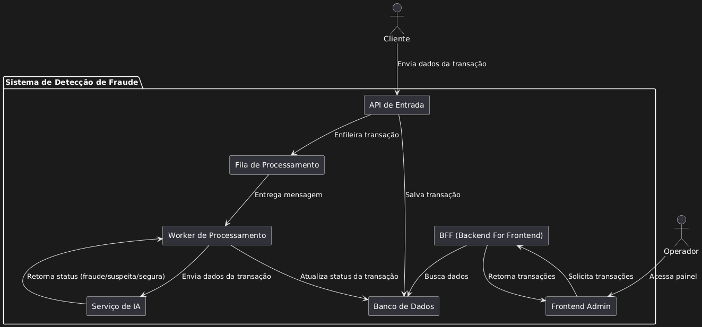

# Delivery Guard

Trata-se de um sistema inteligente desenvolvido para identificar possíveis fraudes em transações de compras online. Utilizando técnicas de Inteligência Artificial (IA), o sistema analisa padrões de comportamento e sinaliza automaticamente atividades suspeitas. As transações identificadas como potencialmente fraudulentas são listadas em um painel administrativo, acessível por meio de um frontend, onde podem ser verificadas manualmente por um operador humano para validação e tomada de decisão.

## 📐 Arquitetura

### **Componentes e Estrutura do Projeto**

1. Frontend (Admin)
    - React com AdminJS
    - Funções:
        - Autenticação de operadores
        - Listagem de transações processadas
        - Visualização de detalhes
        - Ação do operador (ex: marcar como “confirmada” ou “fraude”)
2. BFF (Backend For Frontend)
    - Node.js com Express
    - Responsável por:
        - Fornecer dados formatados para o frontend
        - Agregar informações de diferentes serviços (ex: logs, decisões do modelo, auditoria)
        - Fazer controle de permissões/autenticação para o frontend
3. API de Entrada (Gateway ou API Principal)
    - Python com FastAPI
        - Recebe requisições de clientes com dados da transação
        - Valida e persiste no banco
        - Coloca a transação na fila (RabbitMQ)
4. Fila de Processamento
    - RabbitMQ
    - Garante que as transações sejam processadas de forma assíncrona
5. Serviço de Processamento / Worker
    - Escuta a fila e processa as mensagens
    - Envia os dados para o modelo de IA
    - Recebe o resultado do modelo
    - Atualiza o status da transação no banco de dados

6. Módulo de IA
    - Recebe os dados da transação, faz predição com modelo treinado
    - Retorna um status (ex: “suspeita”, “segura”, “fraude provavel”)

7. Banco de Dados
    - PostgreSQL
    - Tabelas sugeridas:
        - `Transactions` (dados da compra + status IA + status operador)
        - `Customers`
        - `Users` (para o Admin)
        - `TransactionAuditLogs` (ações do operador)
        - `MLPredictions` (opcional: guardar input/output do modelo para auditoria)

## 🛠️ Tecnologias

- Python
- Node.js / Express (API)
- PostgreSQL
- RabbitMQ
- React (Frontend)
- Docker
