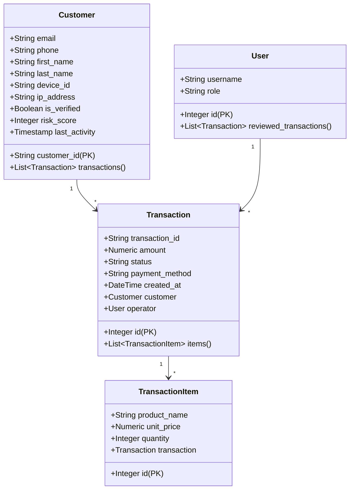

# Delivery Guard

Trata-se de um sistema inteligente desenvolvido para identificar possíveis fraudes em transações de compras online. Utilizando técnicas de Inteligência Artificial (IA), o sistema analisa padrões de comportamento e sinaliza automaticamente atividades suspeitas. As transações identificadas como potencialmente fraudulentas são listadas em um painel administrativo, acessível por meio de um frontend, onde podem ser verificadas manualmente por um operador humano para validação e tomada de decisão.

Diagrama da arquitetura disponível em [`docs/`](./docs).

## 🛠️ Tecnologias

- Python
- FastAPI
- PostgreSQL
- RabbitMQ
- Typescript
- React
- Docker

### Diagrama de classe

